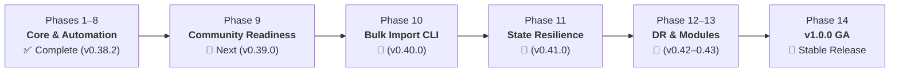

# Project Roadmap: OpenTofu & Terraform Provider for Seerr

Official tracking and community discussion in [GitHub Discussion #161](https://github.com/Josh-Archer/terraform-provider-seerr/discussions/161).

---

## 🌐 Dual Registry & Engine Support

The `seerr` provider is engineered with first-class, simultaneous support for both major Infrastructure as Code ecosystems using the **Terraform Plugin Framework (Protocol 6.0)**:

* **HashiCorp Terraform Registry**: [`registry.terraform.io/providers/josh-archer/seerr`](https://registry.terraform.io/providers/josh-archer/seerr) (Terraform `>= 1.5.0`)
* **OpenTofu Registry**: [`registry.opentofu.org/providers/josh-archer/seerr`](https://registry.opentofu.org/providers/josh-archer/seerr) (OpenTofu `>= 1.6.0`)

Every release is automatically signed with standard **RSA 4096-bit GPG keys** and verified across both registries upon publish.

---

## 📊 Consolidated Phase Progression



| Phase | Target Version | Focus Area | Status |
|:---|:---|:---|:---|
| **Phase 1: Foundational Quality** | `v0.31.0` | Core schema verification, CI fast merge gates, and test suites. | ✅ Completed |
| **Phase 2: Observability & Telemetry** | `v0.32.0` | Diagnostic data sources, server status, and media inspection. | ✅ Completed |
| **Phase 3: Identity & Access Management** | `v0.33.0` | User lifecycle, bitmask permissions (`seerr_permission_set`), and watchlists. | ✅ Completed |
| **Phase 4: Reference Data Helpers** | `v0.34.0` | TMDB genres, languages, and regional lookup data sources. | ✅ Completed |
| **Phase 5: Provider Hardening** | `v0.35.0` | Import support (`ImportState`), input validators, defaults, and plan modifiers. | ✅ Completed |
| **Phase 6: Advanced Resource Lifecycle** | `v0.36.0` | Request approvals/declines, issue comments, and computed user metadata. | ✅ Completed |
| **Phase 7: Servarr Resolvers & Filtering** | `v0.37.1` | Dynamic Radarr/Sonarr entity resolution (quality profiles, root folders, tags) and filterable queries. | ✅ Completed |
| **Phase 8: Production Automation & Dual Registry** | `v0.38.2` | **HashiCorp Terraform Registry** + **OpenTofu Registry** publishing, Google Release Please, and automated OpenAPI drift detection. | ✅ Completed |
| **Phase 9: Community Readiness** | `v0.39.0` | Contributor onboarding (`CONTRIBUTING.md`), issue/PR templates, devcontainer, and Docker dev environment ([#183](https://github.com/Josh-Archer/terraform-provider-seerr/issues/183)). | 🔵 **In Progress** |
| **Phase 10: Import & Migration Tooling** | `v0.40.0` | Bulk CLI generator (`tools/importer`) generating Terraform HCL and `import` blocks from live instances ([#170](https://github.com/Josh-Archer/terraform-provider-seerr/issues/170)). | 📅 Planned |
| **Phase 11: State Resilience & Upgraders** | `v0.41.0` | State schema upgraders, semantic diff suppression, and uniform 404 state removal ([#169](https://github.com/Josh-Archer/terraform-provider-seerr/issues/169)). | 📅 Planned |
| **Phase 12: Observability & Disaster Recovery** | `v0.42.0` | Backup/recovery runbooks, drift detection dashboards, and Prometheus/Grafana metrics presets ([#184](https://github.com/Josh-Archer/terraform-provider-seerr/issues/184)). | 📅 Planned |
| **Phase 13: Module Ecosystem** | `v0.43.0` | Reusable composite modules for turnkey homelab stacks, arr integrations, and alert routing ([#171](https://github.com/Josh-Archer/terraform-provider-seerr/issues/171)). | 📅 Planned |
| **Phase 14: v1.0.0 General Availability** | `v1.0.0` | API stability guarantee, breaking change policy, and full cross-engine acceptance matrix. | 🏁 Planned |

---

## 🎯 Completed Milestone Highlights

### ✅ Dual Registry Publishing (Terraform & OpenTofu)
- **HashiCorp Terraform Registry**: Officially listed and verified at [`registry.terraform.io/providers/josh-archer/seerr`](https://registry.terraform.io/providers/josh-archer/seerr).
- **OpenTofu Registry**: Native indexing at [`registry.opentofu.org/providers/josh-archer/seerr`](https://registry.opentofu.org/providers/josh-archer/seerr).
- **Cryptographic Signing**: All assets signed with verified RSA 4096-bit keys (`F3D8E9C6A7EB82D9E4048FD3A7923AA8E9FE751C`).

### ✅ Zero-Click Automated Releases
- Managed with [Google Release Please](https://github.com/googleapis/release-please) for automated SemVer tagging and changelogs.
- Merging a release PR builds multi-arch binaries and publishes to both registries without manual deployment approvals.

### ✅ Upstream Compatibility & Drift Automation
- Weekly scheduled OpenAPI drift detection (`.github/workflows/openapi-drift.yml`) comparing against upstream `seerr-team/seerr/develop/seerr-api.yml`.
- Daily upstream release watcher (`.github/workflows/upstream-watch.yml`) monitoring new releases from Seerr, Jellyseerr, and Overseerr.
- Comprehensive [Version Compatibility Guide](docs/guides/compatibility.md) and [`COMPATIBILITY.md`](COMPATIBILITY.md).

### ✅ Complete Feature Surface
- **50 Managed Resources** and **69 Data Sources** covering 100% of applicable OpenAPI configuration endpoints.
- **Dynamic Servarr Resolvers**: Direct lookups for Radarr & Sonarr quality profiles, root folders, tags, and language profiles.
- **11 Typed Notification Agents**: Discord, Email, Gotify, LunaSea, Ntfy, Pushbullet, Pushover, Slack, Telegram, Webhook, Webpush with live test triggers (`seerr_notification_agent_test`).

---

## 🔮 Remaining Path to v1.0.0

```text
v0.38.2 (Current) ➔ v0.39.0 (Community) ➔ v0.40.0 (Bulk Import) ➔ v0.41.0 (Resilience) ➔ v0.42.0 (DR) ➔ v0.43.0 (Modules) ➔ v1.0.0 (GA)
```
