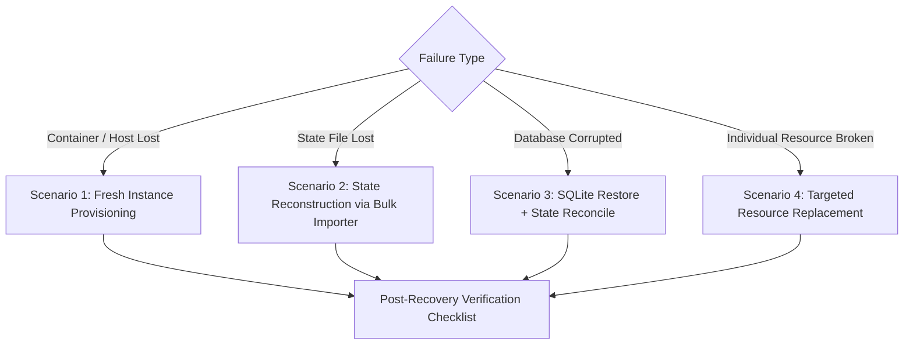

# Disaster Recovery & State Resilience Runbook

This runbook provides step-by-step recovery procedures for restoring Seerr / Jellyseerr / Overseerr services and reconciling OpenTofu / Terraform state across multiple failure scenarios.

---

## 🎯 Disaster Recovery Objectives

- **RTO (Recovery Time Objective)**: < 15 minutes to full service restoration.
- **RPO (Recovery Point Objective)**: 0 configuration loss (guaranteed by version-controlled HCL repository).
- **Automation**: Fully repeatable without manual web UI reconfiguration.

---

## 📋 Failure Scenarios & Recovery Workflows



---

## 🛠️ Scenario 1: Total Instance Loss (Fresh Server Provisioning)

**Condition**: The host or container running Seerr suffered catastrophic failure, but your Terraform code and state file are intact.

### Steps:

1. **Deploy a Fresh Seerr Container/VM**:
   ```bash
   docker run -d \
     --name seerr \
     -p 5055:5055 \
     -v seerr_appdata:/app/config \
     seerr/seerr:latest
   ```

2. **Complete Initial Setup Wizard**:
   - Access `http://NEW_HOST:5055`.
   - Sign in with your Plex, Jellyfin, or local admin credentials to initialize the server.
   - Navigate to **Settings** ➔ **General** and copy the generated **API Key**.

3. **Update Terraform Provider Secrets**:
   ```bash
   export TF_VAR_seerr_url="http://NEW_HOST:5055"
   export TF_VAR_seerr_api_key="NEW_API_KEY"
   ```

4. **Re-Apply Configuration**:
   ```bash
   tofu apply -auto-approve
   ```
   OpenTofu will recreate all managed settings, notification agents, quality profiles, override rules, users, quotas, discover sliders, and scheduled jobs automatically.

5. **Trigger Media Server Library Sync**:
   ```bash
   # If managing library sync resources:
   tofu apply -target=seerr_plex_library_sync.plex
   ```

---

## 🔄 Scenario 2: Terraform State Loss (Live Instance Intact)

**Condition**: Your `.tfstate` file was accidentally deleted or corrupted, but your live Seerr instance is operating normally.

### Steps:

1. **Run the Bulk Importer CLI**:
   The provider includes an automated bulk discovery tool (`tools/importer`) that inspects your live server and generates matching HCL and `import` blocks:
   ```bash
   go run ./tools/importer \
     --url "http://SEERR_HOST:5055" \
     --api-key "YOUR_SEERR_API_KEY" \
     --out-dir "./recovered-tf"
   ```

2. **Verify Generated Imports**:
   Review `./recovered-tf/imports.tf` and `./recovered-tf/main.tf`.

3. **Re-initialize and Import State**:
   ```bash
   cd ./recovered-tf
   tofu init
   tofu plan -detailed-exitcode
   ```
   OpenTofu will adopt all live resources into the new state file with 0 destructive changes.

---

## 💾 Scenario 3: Database Corruption + SQLite Restore

**Condition**: The Seerr SQLite database (`db/db.sqlite3`) became corrupted, requiring a database backup restoration.

### Steps:

1. **Stop the Seerr Service**:
   ```bash
   docker stop seerr
   ```

2. **Locate and Restore the Latest Backup**:
   Seerr writes automated backups to the directory configured in `seerr_backup_settings`:
   ```bash
   ls -la /path/to/seerr/config/backups/
   cp /path/to/seerr/config/backups/seerr_backup_LATEST.sqlite3 /path/to/seerr/config/db/db.sqlite3
   ```

3. **Start the Seerr Service**:
   ```bash
   docker start seerr
   ```

4. **Reconcile Terraform State**:
   Run `tofu plan` to detect any desynchronization between the restored database snapshot and current code:
   ```bash
   tofu plan -detailed-exitcode
   ```
   If drift exists, run `tofu apply` to update the restored database with your latest configuration.

---

## 🎯 Scenario 4: Targeted Resource Replacement

**Condition**: A single resource (e.g. notification agent or Radarr server configuration) is in an inconsistent state.

### Steps:

Force recreation using OpenTofu/Terraform targeted replace:

```bash
# Replace specific notification webhook
tofu apply -replace="seerr_notification_webhook.alerts"

# Replace Radarr server connection
tofu apply -replace="seerr_radarr_server.main_radarr"
```

---

## 🛡️ Proactive Backup Automation

Implement pre-apply state snapshot hooks using [`examples/monitoring/scripts/backup-state.sh`](https://github.com/Josh-Archer/terraform-provider-seerr/blob/main/examples/monitoring/scripts/backup-state.sh):

```bash
# Automated local + S3 snapshot
export SEERR_STATE_BACKUP_DIR="/backups/tofu-state"
export SEERR_STATE_S3_BUCKET="s3://my-homelab-backups/seerr-tf"
export SEERR_STATE_RETENTION_DAYS="30"

./examples/monitoring/scripts/backup-state.sh
```

---

## ✅ Post-Recovery Verification Checklist

After executing any disaster recovery procedure, run through this verification checklist:

- [ ] **API Reachability**: `curl -s -H "X-Api-Key: $KEY" $URL/api/v1/status` returns HTTP 200.
- [ ] **Version Verification**: Server version matches expected compatibility baseline.
- [ ] **Plan Convergence**: `tofu plan -detailed-exitcode` returns exit code `0` (clean, 0 drift).
- [ ] **Notification Test**: Trigger a test notification via `seerr_notification_agent_test`.
- [ ] **Media Server Connectivity**: Test connection to Sonarr (`/api/v1/service/sonarr/test`) and Radarr (`/api/v1/service/radarr/test`).
- [ ] **State Snapshot**: Create a clean state snapshot post-recovery via `backup-state.sh`.
